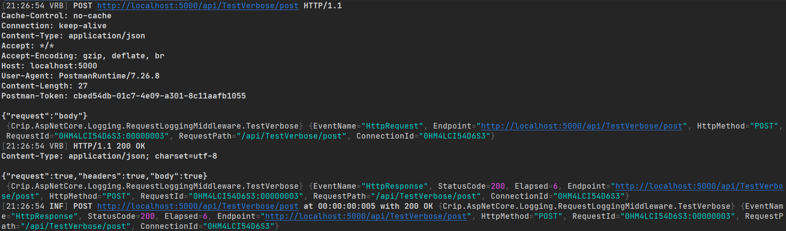
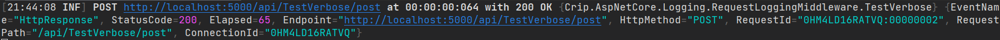
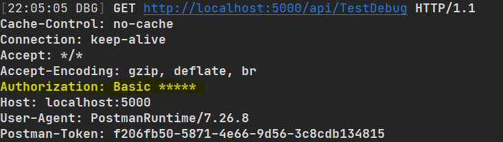
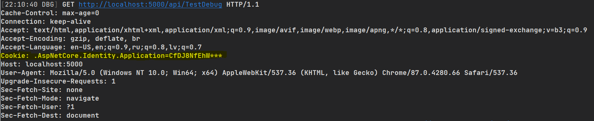

# Crip.AspNetCore.Logging


Make HTTP request logging ease.

## Setup request/response logging in application

Configure log level for a service:

```json
{
  "Logging": {
    "LogLevel": {
      "Default": "Information",
      "Crip.AspNetCore.Logging.RequestLoggingMiddleware": "Trace"
    }
  }
}
```

Configure dependency injection in `Startup.ConfigureServices`:

```c#
services.AddRequestLogging();
```

Add logging middleware in `Startup.Configure`:

```c#
app.UseRouting();

// After routing
app.UseRequestLoggingMiddleware();
// And before endpoints

app.UseEndpoints(endpoints => ... );
```

And now you are ready to see all request/response in logging output:



## Setup HTTP client request/response logging

Configure log level for a service:

```json
{
  "Logging": {
    "LogLevel": {
      "Default": "Information",
      "Crip.AspNetCore.Logging.LoggingHandler": "Trace"
    }
  }
}
```

Configure dependency injection in `Startup.ConfigureServices`:

```c#
services.AddRequestLogging();
```

Register HTTP client with message handler:

```c#
services
    .AddRequestLoggingHandler()
    .AddHttpClient<MyHttpClient>()
    .AddHttpMessageHandler<LoggingHandler<MyHttpClient>>();

// Or use predefined extension method:
services.AddLoggableHttpClient<MyHttpClient>();
```

## Configuration options

### Change verbosity level to reduce logs

With different verbosity level, different output will be written to logs

- `Trace`
    - Writes log message with incoming request headers and body
    - Writes log message with returned response headers and body
    - Writes basic response timing/status message


- `Debug`
    - Writes log message with incoming request headers
    - Writes log message with returned response headers
    - Writes basic response timing/status message


- `Information`
    - Writes basic response timing/status message



- Any other level will not write logs at all.

### Configure verbosity for controller

Each controller has its own source context. This allows configure specific verbosity for a controller. If controller is
named `OrdersController`, you can set verbosity for it in configuration:

```json
{
  "Logging": {
    "LogLevel": {
      "Default": "Information",
      "Crip.AspNetCore.Logging.RequestLoggingMiddleware": "None",
      "Crip.AspNetCore.Logging.RequestLoggingMiddleware.Orders": "Trace"
    }
  }
}
```

In this case only `OrdersController` requests/responses will be written to logs.

### Configure verbosity for HTTP client

When you register client message handler with type `.AddHttpMessageHandler<LoggingHandler<MyHttpClient>>()`, this value
is used as source context postfix.

```json
{
  "Logging": {
    "LogLevel": {
      "Default": "Information",
      "Crip.AspNetCore.Logging.LoggingHandler": "None",
      "Crip.AspNetCore.Logging.LoggingHandler.MyHttpClient": "Trace"
    }
  }
}
```

In this case only `MyHttpClient` requests/responses will be written to logs.

### Filter endpoints

If there is some endpoints you would like to exclude from logs, you can configure predicate:

```c#
services.AddRequestLoggingExclude("/images*", "/swagger*")
```

Or if you like to include only API requests in logging:

```c#
services.AddSingleton<IHttpRequestPredicate>(provider =>
    new EndpointPredicate(false, "/api*"));
```

Or create your own `IHttpRequestPredicate` implementation and add it to service collection.

### Filter logged content

By default `AuthorizationHeaderLoggingMiddleware` and `LongJsonContentMiddleware` are added in to logger. You can create
own implementations of the `IHeaderLogMiddleware` or `IRequestContentLogMiddleware` to modify logged content for your
own needs.

#### IHeaderLogMiddleware

`AuthorizationHeaderLoggingMiddleware` implements `IHeaderLogMiddleware` interface and will hide Authorization header
values replacing `Basic` auth header value with `Basic *****` and `Bearer` auth header value with `Bearer *****`.



You can add `CookieHeaderLoggingMiddleware` to avoid cookie value write to logs:

```c#
services
    .AddRequestLogging()
    .AddRequestLoggingCookieValueMiddleware();
```



#### IRequestContentLogMiddleware

`LongJsonContentMiddleware` implements `IRequestContentLogMiddleware` interface and will hide properties value if its
length exceeds 500 characters and will output only first 10 symbols:

```json
{
  "fileBase64": "SGVsbG8gV2***"
}
```

This middleware runs only if request content type is `application/json`. You can change this middleware values within
configuration file:

```json
{
  "Logging": {
    "Request": {
      "MaxCharCountInField": 1000,
      "LeaveOnTrimCharCountInField": 3
    }
  }
}
```

---

For more technical details take a look in [example project Startup file](./Crip.AspNetCore.Logging.Example.Web/Startup.cs).
